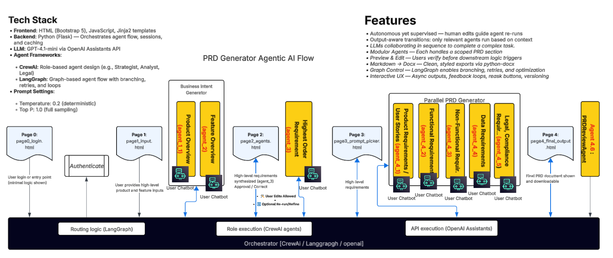

# Leapfrog AI Workbench — POCs Overview and Operations Guide

This repository contains a suite of Python/Flask proof‑of‑concept (POC) backends that together form the Leapfrog AI Workbench. You can run them all with Docker Compose or locally with Python. This README provides: what each POC does, how they fit together, how to install and run, how to develop, and how to troubleshoot.

## Contents
- What’s included and ports
- Architecture and flow diagrams
- Prerequisites (Windows, Docker Desktop, WSL2)
- Quick start with Docker Compose
- Local (non‑Docker) start scripts
- Development workflow: code changes, dependencies, and rebuilds
- Troubleshooting (Docker on Windows, ports, logs)

---

## What’s included

The workbench exposes six POCs. All bind to port 5001 inside the container; host ports are mapped uniquely.

| Service | Path / File | Host Port | Container Port | Purpose |
|---|---|---:|---:|---|
| poc1 | `product_workbench_requirement_definition.py` | 5001 | 5001 | PRD generator / requirement definition |
| poc2 | `product_workbench_backlog_management.py` | 5002 | 5001 | Backlog manager with tabbed workbench UI |
| poc3 | `poc3/backend/app.py` | 5050 | 5001 | Delivery workbench (original) |
| poc3b | `poc3b/backend/app.py` | 5051 | 5001 | Delivery/requirements insights (enhanced) |
| poc4 | `poc4/migration_reconciliation.py` | 5000 | 5001 | Data migration and reconciliation |
| poc5 | `poc5/product_architecture_definition.py` | 6060 | 5001 | Architecture workbench |

Endpoints (when running with Docker Compose):
- POC1: http://127.0.0.1:5001/
- POC2: http://127.0.0.1:5002/ and workbench: http://127.0.0.1:5002/tabbed-layout
- POC3: http://127.0.0.1:5050/
- POC3b: http://127.0.0.1:5051/
- POC4: http://127.0.0.1:5000/
- POC5: http://127.0.0.1:6060/

Notes:
- POC2 logs will warn if `OPENAI_API_KEY` is not set. The app works with limited AI features without the key.
- The repository also includes orchestrator overview HTMLs in `templates/` and at the root for standalone view.

---

## Architecture

High‑level diagram of how the POCs run under Docker Compose (GitHub renders Mermaid):


POC relationships are loose; each service can be run independently.

---

## Visual Overview & Gallery

High-level overview pages included in this repo:

- Orchestrator (template version): `templates/orchestrator_overview.html`
- Orchestrator (standalone HTML): `orchestrator_overview_standalone.html`

Screens and flows (click to view in repo):

<table>
   <tr>
      <td align="center">
         <a href="static/img/poc1_prd_flow.png"></a><br/>
         <sub>POC1 — PRD Flow</sub>
      </td>
      <td align="center">
         <a href="static/img/poc2_backlog_flow.png"></a><br/>
         <sub>POC2 — Backlog Flow</sub>
      </td>
   </tr>
   <tr>
      <td align="center">
         <a href="static/img/poc3_delivery_flow.png"></a><br/>
         <sub>POC3 — Delivery Flow</sub>
      </td>
      <td align="center">
         <a href="static/img/poc3b_requirements_flow.png"></a><br/>
         <sub>POC3b — Requirements Insights</sub>
      </td>
   </tr>
   <tr>
      <td align="center">
         <a href="static/img/poc4_data_migration_flow.png"></a><br/>
         <sub>POC4 — Data Migration</sub>
      </td>
      <td align="center">
         <a href="static/img/poc5_architecture_workbench_flow.png"></a><br/>
         <sub>POC5 — Architecture Workbench</sub>
      </td>
   </tr>
</table>

Additional legacy process flows:

- `static/processflow.png`
- `static/processflow1.png`

---

## POC descriptions

### POC 1 — PRD Generator (Requirement Definition)
- Entrypoint: `product_workbench_requirement_definition.py`
- Purpose: Ingest product inputs to generate structured PRDs and requirement artifacts.
- Default port: 5001 (host)

### POC 2 — Backlog Manager (Tabbed Workbench)
- Entrypoint: `product_workbench_backlog_management.py`
- Purpose: Manage backlog items, story details, and flows through a tabbed UI.
- Default port: 5002 (host), path `/tabbed-layout`.
- Note: Warns when `OPENAI_API_KEY` is not set. Set it to enable AI features.

### POC 3 — Delivery Workbench (Original)
- Entrypoint: `poc3/backend/app.py`
- Purpose: Delivery workbench features; developer tools and flows.
- Default port: 5050 (host)

### POC 3b — Delivery/Requirements Insights (Enhanced)
- Entrypoint: `poc3b/backend/app.py`
- Purpose: Enhanced insights and flows for delivery and requirements.
- Default port: 5051 (host)

### POC 4 — Data Migration & Reconciliation
- Entrypoint: `poc4/migration_reconciliation.py`
- Purpose: Data migration, reconciliation helpers, and validation tooling.
- Default port: 5000 (host)

### POC 5 — Architecture Workbench
- Entrypoint: `poc5/product_architecture_definition.py`
- Purpose: Capture and render target architecture and system mappings.
- Default port: 6060 (host)

---

## Prerequisites (Windows)

- Docker Desktop for Windows
   - Enable “Use the WSL 2 based engine” (recommended)
   - Ensure the engine shows “Running”
- Git, VS Code (optional but recommended)
- Optional for local, non‑Docker runs: Python 3.11 and a virtual environment

Permissions (first‑time setup):
- Add your user to the `docker-users` group from an elevated PowerShell, then sign out/in:

```powershell
$User = "$env:USERDOMAIN\$env:USERNAME"
net localgroup docker-users $User /add
```

Select and verify Docker context:

```powershell
docker context use desktop-linux
docker version  # Ensure you see both Client and Server
```

---

## Quick start — Docker Compose

1) Start Docker Desktop and wait until the engine is running.
2) From the repo root, build all images:

```powershell
docker compose build
```

3) Start all services in the background:

```powershell
docker compose up -d
```

4) Visit the endpoints:
- http://127.0.0.1:5001 (POC1)
- http://127.0.0.1:5002 (POC2)
- http://127.0.0.1:5002/tabbed-layout (POC2 workbench)
- http://127.0.0.1:5050 (POC3)
- http://127.0.0.1:5051 (POC3b)
- http://127.0.0.1:5000 (POC4)
- http://127.0.0.1:6060 (POC5)

Status and logs:

```powershell
docker compose ps
docker compose logs -f poc2  # tail a specific service
```

Stop everything:

```powershell
docker compose down
```

### Environment variables (e.g., OPENAI_API_KEY)

To enable AI features for some services (e.g., POC2), set the variable before `up`:

```powershell
$env:OPENAI_API_KEY = "sk-..."
docker compose up -d
```

Alternatively, create a `.env` file in the repo root (not committed by default) and export it into services via Compose. For a production‑grade setup, you can extend `docker-compose.yml` to pass `OPENAI_API_KEY: ${OPENAI_API_KEY}` to the services that need it.

---

## Local start (non‑Docker)

You can run all POCs directly with Python using the provided batch script on Windows.

1) Create and activate a virtual environment; then install dependencies:

```powershell
python -m venv .venv
.\.venv\Scripts\Activate.ps1
pip install -r requirements.txt
```

2) Launch everything (opens separate CMD windows):

```powershell
start .\start_all_pocs.bat
```

The script starts:
- POC1 at http://127.0.0.1:5001/
- POC2 at http://127.0.0.1:5002/ (workbench at `/tabbed-layout`)
- POC3 at http://127.0.0.1:5050/
- POC3b at http://127.0.0.1:5051/
- POC4 at http://127.0.0.1:5000/
- POC5 at http://127.0.0.1:6060/

---

## Development workflow

Because containers mount the repo (`./` to `/app`), code changes appear immediately inside containers. Whether you must restart depends on the service:

- Auto‑reload (Flask debug on): poc3, poc3b, poc4, poc5
   - Changes in `.py`, templates, static assets typically reload automatically.
- Manual restart (Flask debug off): poc1, poc2
   - Restart the container to pick up changes:

```powershell
docker compose restart poc2
```

### Dependency changes

If you change `requirements.txt` or `Dockerfile` logic:

```powershell
# Rebuild just one service and recreate it
docker compose up -d --no-deps --build poc2

# Or rebuild everything and bring up
docker compose build
docker compose up -d
```

Force a clean rebuild if needed:

```powershell
docker compose build --no-cache
docker compose up -d --force-recreate
```

### Useful commands

```powershell
# Status and ports
docker compose ps

# Tail logs for a service
docker compose logs -f poc3

# Exec into a container shell
docker compose exec poc3 sh
```

---

## Troubleshooting

### Docker Desktop named pipe error on Windows

Error examples:
- `open //./pipe/dockerDesktopLinuxEngine: The system cannot find the file specified.`
- `in the default daemon configuration on Windows, the docker client must be run with elevated privileges to connect`

Fix:
1) Start Docker Desktop and wait for “Engine running”.
2) Use the Linux context and verify server connectivity:

```powershell
docker context use desktop-linux
docker version
```

3) If you see “Access is denied” when adding to `docker-users`, run PowerShell as Administrator:

```powershell
$User = "$env:USERDOMAIN\$env:USERNAME"
net localgroup docker-users $User /add
```

Sign out and back in to apply group membership.

4) If using WSL 2 engine, ensure WSL is installed and healthy:

```powershell
wsl --status
```

### Ports don’t respond

- Confirm containers are up and ports mapped:

```powershell
docker compose ps
```

- Tail logs for the service to see bind address and port (should be 0.0.0.0:5001 inside):

```powershell
docker compose logs -f poc4
```

- Ensure no host process is already using the host port (5000/5001/5002/5050/5051/6060). Close conflicting apps or change host ports in `docker-compose.yml`.

### Slow or flaky builds on Windows

- Ensure the repo’s `.venv/` is excluded from build context (it is via `.dockerignore`).
- If cache is inconsistent, do a clean rebuild:

```powershell
docker compose build --no-cache
```

### OPENAI_API_KEY not set

- Set it in your shell before `docker compose up`:

```powershell
$env:OPENAI_API_KEY = "sk-..."
```

Or pass it via Compose environment mapping for the services that need it.

---

## Reference

- Docker image base: `python:3.11-slim` (see `Dockerfile`)
- Compose mounts: `./ -> /app` (hot code in containers)
- Ports mapping (host -> container 5001): 5001, 5002, 5050, 5051, 5000, 6060
- Local launcher: `start_all_pocs.bat`
- Orchestrator views: `templates/orchestrator_overview.html`, `orchestrator_overview_standalone.html`

If you want auto‑reload for poc1/poc2 in Docker, we can enable Flask debug for those services in `docker-compose.yml`. Open an issue or request and we’ll wire it up.
# PRD Generator Assistant

# Agentic AI Workflow – OpenAI Assistants

This project is an **agentic AI workflow platform** that orchestrates multiple OpenAI assistants (agents) to automate and validate business requirements, compliance, architecture, and more. It features a modern web UI and a modular backend, making it easy to extend and adapt for enterprise use cases.


## 📋 Table of Contents
- [Overview](#overview)
- [Features](#features)
- [Prerequisites](#prerequisites)
- [Installation](#installation)
- [Configuration](#configuration)
- [Running the Application](#running-the-application)
- [Usage Guide](#usage-guide)
- [Troubleshooting](#troubleshooting)
- [Development](#development)
- [License](#license)

## 🎯 Overview

This Flask-based web application integrates with OpenAI's API to generate comprehensive Product Requirements Documents (PRDs). It utilizes multiple AI agents to analyze requirements and produce structured documentation.

## 🔧 Tech Stack

### Frontend
- HTML with Bootstrap 5
- JavaScript for dynamic interactions
- Jinja2 templating engine

### Backend
- Python (Flask) for server-side logic
- Session management and caching
- Agent orchestration and workflow control

### LLM Integration
- GPT-4.1-mini via OpenAI Assistants API
- Async request handling
- Structured output parsing

### Agent Frameworks
- **CrewAI**: Role-based agent architecture
  - Specialized agents (Strategist, Analyst, Legal)
  - Inter-agent communication
- **LangGraph**: Flow control system
  - Branching logic
  - Retry mechanisms
  - Loop handling

### Prompt Configuration
- Temperature: 0.2 (optimized for deterministic output)
- Top P: 1.0 (complete sampling for comprehensive analysis)

## ✨ Features

### Core Functionality
- Multi-agent AI system for requirement analysis
- Interactive web interface
- Real-time document generation
- Markdown to Word document conversion
- Session management
- Progress tracking
- Error handling and logging

### Advanced Features
- **Autonomous yet Supervised**
  - Human edits guide agent re-runs
  - Iterative refinement process
  - Quality control checkpoints

- **Smart Workflow**
  - Output-aware transitions between agents
  - Context-based agent selection
  - Sequential LLM collaboration
  - Modular agent architecture

- **User Experience**
  - Preview & Edit functionality
  - Interactive async outputs
  - Feedback loops and reask options
  - Version control for all outputs

- **Document Processing**
  - Markdown → Docx conversion
  - Styled exports via python-docx
  - Clean, professional formatting

- **Technical Control**
  - LangGraph-powered flow control
  - Branching and retry logic
  - Process optimization
  - Comprehensive error handling

## 🔧 Prerequisites

- Python 3.78 or higher
- pip (Python package manager)
- Virtualenv
- Windows, macOS, or Linux operating system
- Modern web browser (Chrome, Firefox, Edge recommended)
- OpenAI API key with appropriate permissions

## 📥 Installation

1. **Clone the Repository**
   ```powershell
   git clone https://github.com/yourusername/openai-assistant-clean.git
   cd openai-assistant-clean
   ```

   ```bash
   git clone https://github.com/lukelallu/openai-assistant-clean.git
   cd openai-assistant-clean
   python3 -m venv venv
   source venv/bin/activate
   pip install -r requirements.txt

2. **Create Virtual Environment** (Recommended)
   ```powershell
   python -m venv venv
   .\venv\Scripts\activate  # Windows
   ```

3. **Install Dependencies**
   ```powershell
   pip install -r requirements.txt
   ```

## ⚙️ Configuration

1. **Environment Setup**
   Create a `.env` file in the project root:
   ```env
   OPENAI_API_KEY=your_api_key_here
   FLASK_SECRET_KEY=your_secret_key_here
   ADMIN_USERNAME=your_username
   ADMIN_PASSWORD=your_password
   REDIS_HOST=localhost  # Optional
   REDIS_PORT=6379      # Optional
   ```

2. **Redis Configuration** (Optional)
   - Install Redis if you want to use it for session management
   - Update Redis configuration in `.env`

3. **MCP Client Configuration** (Optional)
   - If using MCP integration, ensure `mcp_client.py` and `use_mcp_agent.py` are present.
   - Update `.env` with your MCP credentials as shown above.


## 🚀 Running the Application [v1]

1. **Start the Application**
   ```powershell
   python .\new-prd-workflow.py
   ```

2. **Access the Web Interface**
   - Open your browser
   - Navigate to `http://localhost:7001`
   - Log in with your configured credentials

## 🚀 Running the Application [v2]

1. **Start the Application**
   ```powershell
   python .\new-prd-workflow.py
   ```

2. **Start the New Workflow (v2)**
   ```powershell
   python .\new_prd_workflow_file_v2.py
   ```

3. **Start the MCP Agent API (if using MCP integration)**
   ```powershell
   uvicorn use_mcp_agent:app --port 4000
   ```

4. **Access the Web Interface**
   - Open your browser
   - Navigate to `http://localhost:7002`
   - Log in with your configured credentials

   
## 📖 Usage Guide

### Login Page
1. Enter your admin credentials
2. Click "Login" to access the system

### Page 1: Initial Input
1. Enter industry details
2. Provide sector information
3. Specify geography
4. Define project intent
5. List key features

### Page 2: Review & Edit
1. Review generated content
2. Edit if necessary
3. Proceed to requirements

### Page 3: Requirements Generation
1. Review high-level requirements
2. Click "Approve & Generate PRD Draft"
3. Wait for processing (progress indicator shown)

### Page 4: Final Document
1. Review all sections
2. Click "Download as Word" for final document
3. Save the generated PRD

## ❗ Troubleshooting

### Common Issues
1. **Connection Errors**
   ```
   Error: OpenAI API connection failed
   Solution: Check API key and internet connection
   ```

2. **Document Generation Failed**
   ```
   Error: Document generation failed
   Solution: Check browser console (F12) for detailed logs
   ```

3. **Session Expired**
   ```
   Error: Session expired
   Solution: Log in again
   ```

### Logging
- Application logs are stored in `app.log`
- Use browser DevTools (F12) for frontend issues
- Check terminal output for backend errors

## 💻 Development

### Project Structure
```
openai-assistant-clean/
├── agents/
│   └── (agent modules and logic)
├── utils/
│   └── (utility functions and helpers)
├── templates/
│   ├── page0_login.html
│   ├── page1_input.html
│   ├── page2_agents.html
│   ├── page3_prompt_picker.html
│   └── page4_final_output.html
├── static/
│   └── js/
│       └── global.js
├── mcp_client.py
├── use_mcp_agent.py
├── new-prd-workflow.py
├── new_prd_workflow_file_v2.py
├── requirements.txt
├── .env
└── tests/
    └── (unit and integration tests)
```

### Running in Debug Mode
```powershell
$env:FLASK_ENV = "development"
python .\new-prd-workflow.py
```

### Testing
- Run unit tests: `python -m pytest tests/`
- Check code style: `python -m flake8`

## 📄 License

This project is licensed under the MIT License. See the [LICENSE](LICENSE) file for details.

---

**Note**: Keep your API keys and credentials secure. Never commit sensitive information to version control.